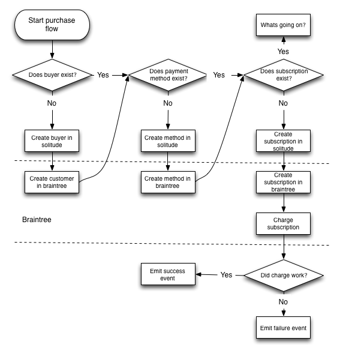
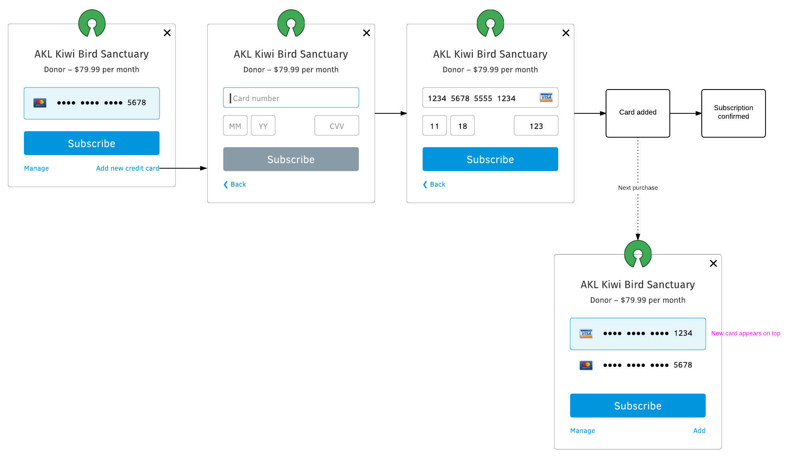
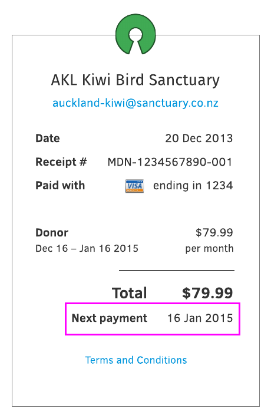

Proposed backend API
====================

Payment API
-----------

This is a rough draft of the backend API for Payments for Firefox Accounts.
This is based on solitude, but at this point it might not need to be.

TODO: figure out the appropriate relationship between seller and product.

This is the API needed to have a buyer who has *never purchased* anything with
Mozilla before complete a subscription sign up.

* **POST /buyer**: create a buyer.
* **POST /provider/tokenized-payment-method**: A stub for getting tokenized
  payment data from the provider.
* **POST /payment**: create a payment method. Requires: buyer, payment
  method information.
* **POST /subscription**: create a subscription. Requires: buyer, seller and
  payment method.
* **POST /transaction**: create a solitude transaction to start the first
  subscription. Requires: subscription.
* **POST /provider/charge-subscription**: tries to run a charge against the
  subscription at the payment provider.
* **PATCH /transaction/int:id**: update the transaction with information from
  the charge attempt. Requires: subscription attempt information.

To create a new payment method:

* **POST /provider/tokenized-payment-method**: A stub for getting tokenized
  payment data from the provider.
* **POST /payment**: create a payment method. Requires: buyer, payment
  information.

To change a subscription method:

* **PATCH /subscription/int:id**: updates the subscription. Requires: new
  payment method information. The buyer and seller could not be changed.

To cancel a subscription:

* **PATCH /subscription/int:id**: patch a subscription. Requires: new state
  of subscription active/inactive.

To get a list of all transactions:

* **GET /transaction?buyer=...**: filter buy buyer. This would be paginated, so
  we should order by newest first.

To get a list of all subscriptions:

* **GET /subscription?buyer=...**: filter buy buyer. This would be paginated,
  so we should order by newest first.

Provider API
------------

How we interact with braintree:

Events
------

The backend will need to send the following events, these might be sent as
emails, or other method, or ignored.

* Payment method created.
* Payment method updated for subscription.
* Subscription created.
* Subscription charge succeeded (e.g. every month).
* Subscription charge failed.
* Subscription cancelled.

TODO: figure out how solitude would signal out these events.

Payment method created
++++++++++++++++++++++

When a new credit card is added event, it’s immediately visible on the purchase flow:

There’s no need to send an email unless we’re concerned about unauthorised
access. (For example, Facebook would tell you if you’re signed in from an
unknown device.)

Payment method updated for subscription
+++++++++++++++++++++++++++++++++++++++

Gist: each subscription can be paid with different credit cards. When the credit card change, should we send an email that says “This subscription is now paid using B instead of A”?

* If card is updated then immediately used to pay, email receipt will contain the new card information, so no need for separate notification.

.. image:: ux-email-receipt-highlight-payment-method.png

* If card is updated but not used to pay until sometime afterwards, should we let user know? Probably not.

  * First of all, card is always updated manually, so user always know that it has happened
  * Secondly, when the email receipt comes a few days/weeks later, it will contain the new card information in it.

Subscription created
++++++++++++++++++++

This notification is already contained within the email receipt. A subscription receipt will have an extra field that says “Next payment":

This makes a separate “You’re subscribed to [product]” email unnecessary.

Subscription charge succeeded
+++++++++++++++++++++++++++++

The reception of email receipt indicates that the charge was succeeded.

Subscription charge failed
++++++++++++++++++++++++++

This will need email notification. It should at the very least specify:

* Subscription name/logo
* Amount
* Payment method used
* Link to fix it

.. image:: ux-email-receipt-subscription-charge-failed.png

On the link to fix it, user can do these things:

* Try again with the same method
* Edit method, then try again

  * Change it with another method that’s already stored
  * Add a new method, then use it

I’m not sure where this link should lead to. Should it lead to the buy flow iframe, or the payments dashboard instead? I am tempted to keep things really simple and just rely on the buy flow for everything.

Subscription cancelled
++++++++++++++++++++++
No email necessary, but on the subscription cancellation UI (this is relevant in the Dashboard), we should acknowledge two things:

* Reassure user that the payment method is not going to be charged again
* Reiterate whether the subscription is still valid or not

  * If still valid, then until when? Give exact date
  * If not valid, then we should let it know that subscription will cease the moment user clicks “cancel”

I think this is a job that can be accomplished using a really good subscription cancellation UI. It should say “Your subscription will be valid until [date]/Your subscription will instantly terminate. [Keep my subscription/Cancel]”

Summary
-------
Should we send email notification during this event?

* Payment method created: no
* Payment method updated for subscription: no
* Subscription created: no
* Subscription charge succeeded (e.g. every month): no
* Subscription charge failed: yes
* Subscription cancelled: no
