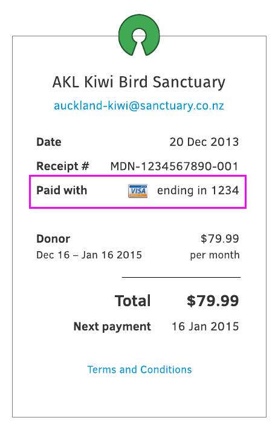
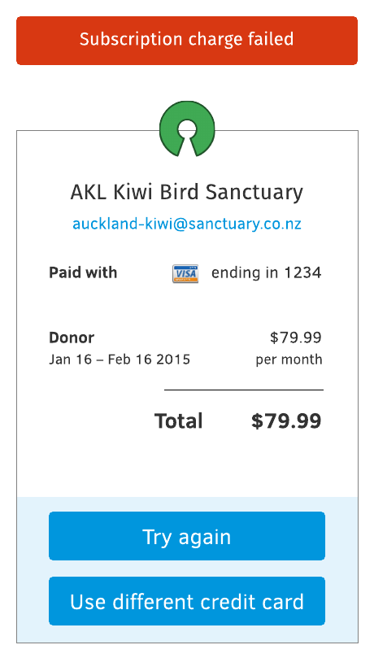
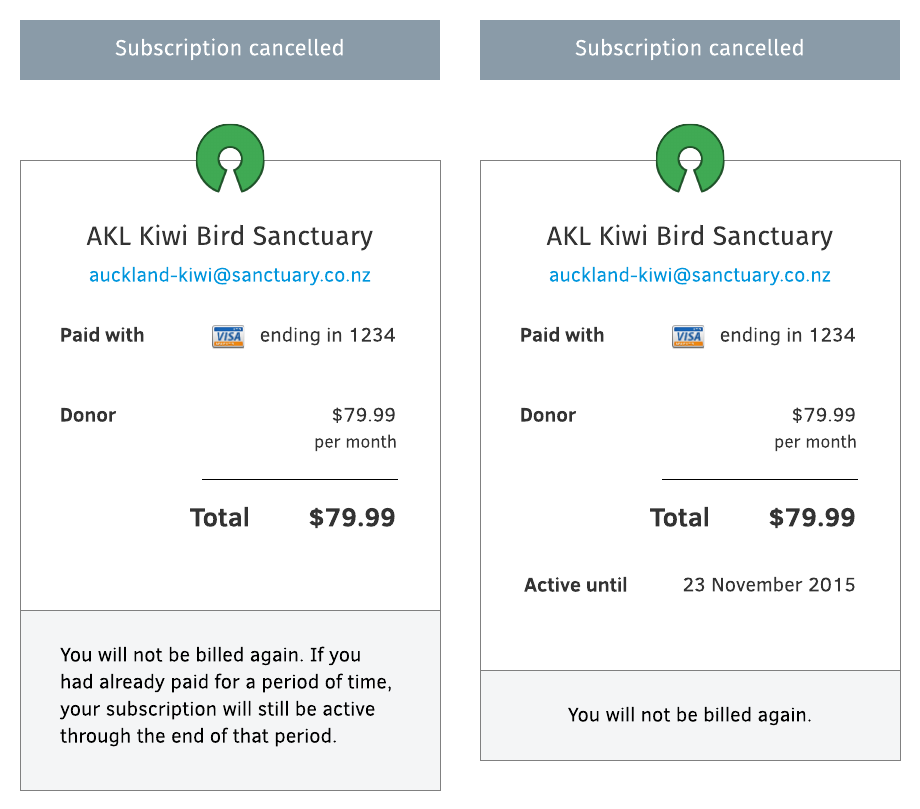

Emails
------

The backend will need to send the following events to subscribers. Usually as emails.
These might be sent as emails, or other method, or ignored.

* Payment method created.
* Payment method updated for subscription.
* Subscription created.
* Subscription charge succeeded (e.g. every month).
* Subscription charge failed.
* Subscription cancelled.

Payment method created
++++++++++++++++++++++

When a new credit card is added event, it’s immediately visible on the management pages.

TODO: the image below is out of date.

.. image:: api/ux-add-new-card-wireframe.png

There’s no need to send an email unless we’re concerned about unauthorised access. (For example, Facebook would tell you if you’re signed in from an unknown device.)

Payment method updated for subscription
+++++++++++++++++++++++++++++++++++++++

Gist: each subscription can be paid with different credit cards. When the credit card changes, should we send an email that says “This subscription is now paid using B instead of A”?

* If card is updated then immediately used to pay, email receipt will contain the new card information, so no need for separate notification.

* If card is updated but not used to pay until sometime afterwards, should we let user know? Probably not.

  * First of all, card is always updated manually, so user always know that it has happened
  * Secondly, when the email receipt comes a few days/weeks later, it will contain the new card information in it.

Subscription created
++++++++++++++++++++

This notification is already contained within the email receipt. A subscription receipt will have an extra field that says “Next payment":

.. image:: api/ux-email-receipt-highlight-next-payment.png

This makes a separate “You’re subscribed to [product]” email unnecessary.

Subscription charge succeeded
+++++++++++++++++++++++++++++

When a subscription charge succeeds, a receipt is sent.

Subscription charge failed
++++++++++++++++++++++++++

This will need email notification. It should at the very least specify:

* Subscription name/logo
* Amount
* Payment method used
* Link to fix it

On the link to fix it, user can do these things:

* Try again with the same method
* Edit method, then try again

  * Change it with another method that’s already stored
  * Add a new method, then use it

I’m not sure where this link should lead to. Should it lead to the buy flow iframe, or the payments dashboard instead? I am tempted to keep things really simple and just rely on the buy flow for everything.

Subscription cancelled
++++++++++++++++++++++
Subscription cancellation can happen without the users being present. For example the default flow is something like:

* charge fails, notify user
* 10 days later, charge fails, notify user
* 20 days later, charge fails, cancel subscription.

In the UI and other elements, we should:

* Reassure user that the payment method is not going to be charged again
* Reiterate whether the subscription is still valid or not

  * If still valid, then until when? Give exact date
  * If not valid, then we should let it know that subscription will cease the moment user clicks “cancel”

Summary
+++++++
Should we send email notification during this event?

* Payment method created: no
* Payment method updated for subscription: no
* Subscription created: no
* Subscription charge succeeded (e.g. every month): yes
* Subscription charge failed: yes
* Subscription cancelled: yes
