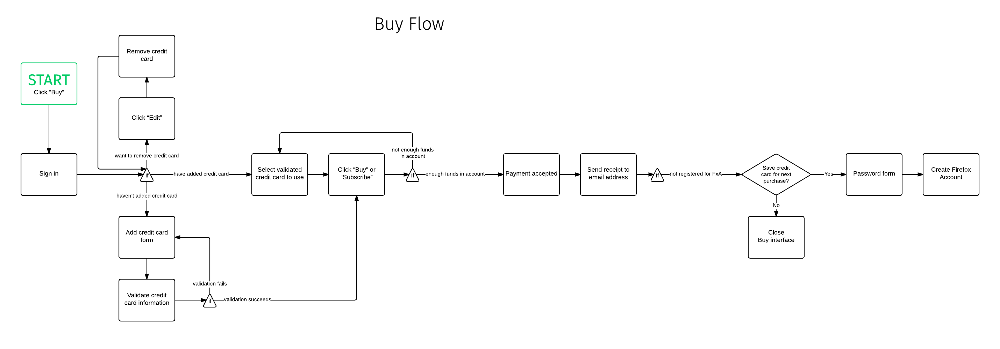
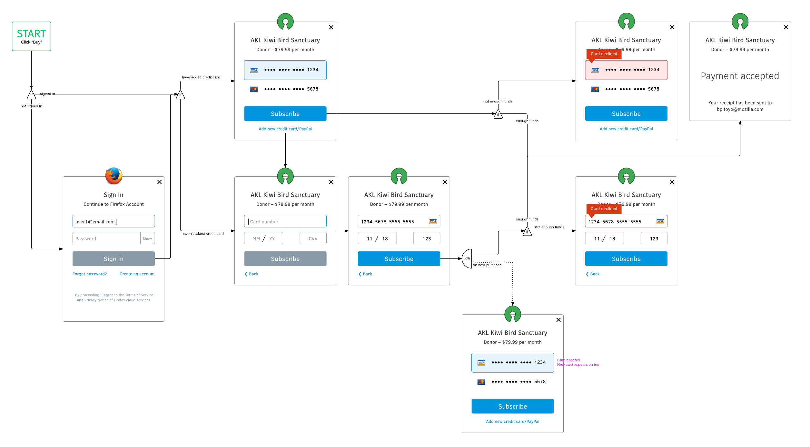
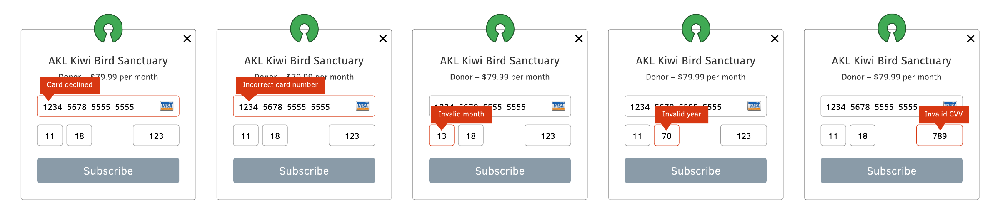
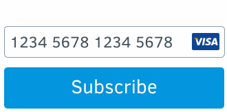
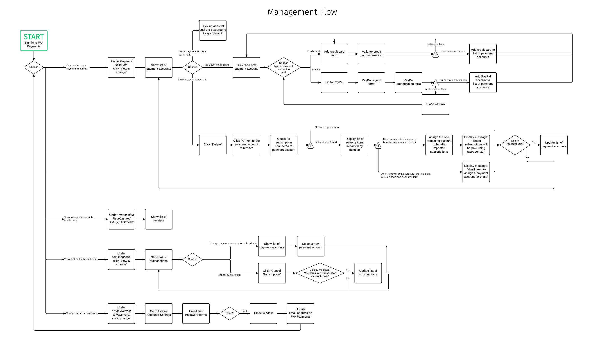
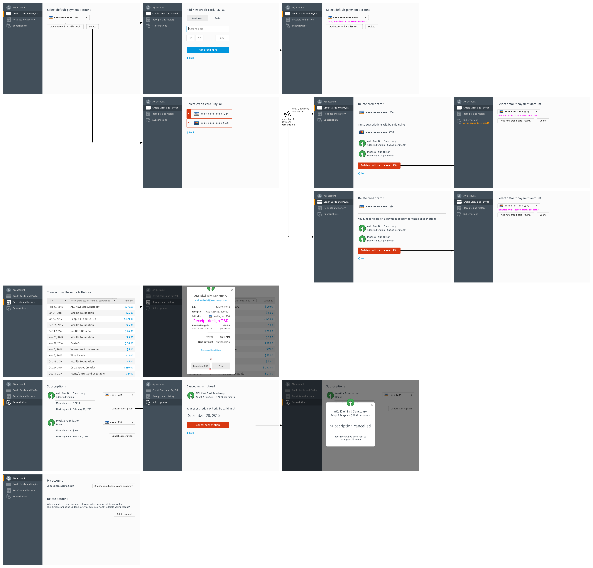
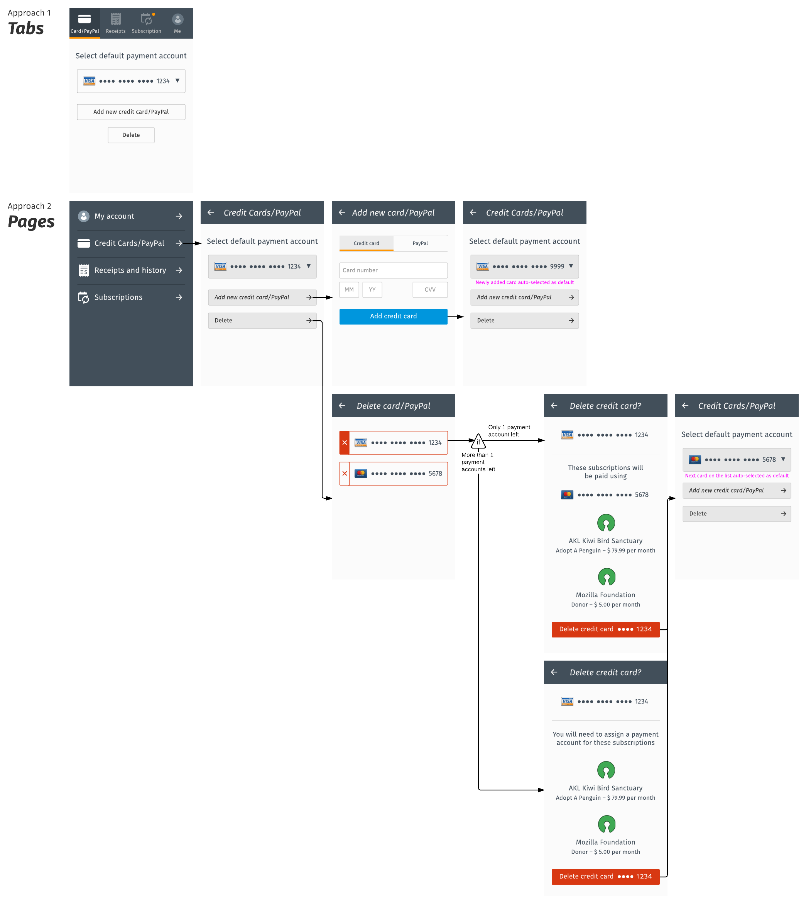

User experience documentation
=============================

User experience documentation.

Status: **in draft** expect changes.

.. _purchase-label:

Purchase
--------

Flow chart:

Wireframe of flow:

Labelling form fields for accessibility:

.. image:: ux-pay-field-label-animation.png

Kinds of errors:

- Card declined
- Incorrect card number
- Invalid month
- Invalid year
- Invalid CVV

Handling errors:

Management
----------

Flow chart:

Wireframe of flow:

Replace all subscriptions:

- Replace all subscription will appear when two conditions are satisfied:
  + User has more than 1 subscriptions – the logic being, if you only have 1 subscription, you don’t need to replace all – and
  + User has more than 1 payment account left after removal – the logic being, if you only have 1 account left, then that account is automatically selected and this dialogue won’t need to appear at all.
- Once user selects an item on this dropdown menu, every dropdown menu on every subscription will be updated with what she had just selected. In other words, the selection propagates.
- User can override this by manually selecting the payment account under each subscription