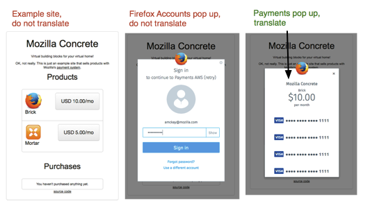

Localisation
============

Localisation is done in the `payments-l10n repository <https://github.com/mozilla/payments-l10n/>`_ through Verbatim and Pontoon (details to come).

The example site is not currently translated, we expect the clients to localise their own site. Details of what should be translated on: http://pay.dev.mozaws.net/

The management interface is accessible at for testing translations at: http://pay.dev.mozaws.net:8000/management.html
